# Architecture Overview

## 1. Overview

ClickNBack is a demo backend system showcasing production-grade engineering in a financially sensitive domain. The architecture reflects design constraints around deployability, financial correctness, and professional maturity, with a modular monolith structure that enables independent domain teams while maintaining strict financial consistency and auditability.

### 1.1. Core Design Constraints

1. **Deployability**: Must run in isolation (docker-compose) for easy local demonstration and evaluation.
2. **Financial Correctness**: All state transitions and balance updates must be deterministic and safe under concurrent access.
3. **Professional Maturity**: Demonstrate pragmatic trade-offs, not hype-driven architecture.

---

## 2. System Architecture

```mermaid
graph TB
    subgraph "API Layer"
        HTTP["FastAPI Application"]
    end
    
    subgraph "Feature Modules - Domain-Driven Organization"
        Users["👤 Users Module"]
        Merchants["🏪 Merchants Module"]
        Offers["🎁 Offers Module"]
        Purchases["📦 Purchases Module"]
        Wallets["💰 Wallets Module"]
        Payouts["💳 Payouts Module"]
    end
    
    subgraph "Service & Persistence Layer"
        UserSvc["UserService"]
        MerchantSvc["MerchantService"]
        CashbackCalcSvc["CashbackCalculator"]
        
        UserRepo["UserRepository"]
        MerchantRepo["MerchantRepository"]
        PurchaseRepo["PurchaseRepository"]
        WalletRepo["WalletRepository"]
    end
    
    subgraph "Core/Shared Infrastructure"
        DB["Database Session Manager"]
        Config["Configuration"]
        Security["Security & Auth"]
        Policies["Business Policies<br/>RateLimiting, Validation"]
    end
    
    subgraph "Data Layer"
        PostgreSQL[("PostgreSQL<br/>Source of Truth")]
    end
    
    HTTP -->|Routes & validates| Users
    HTTP -->|Routes & validates| Merchants
    HTTP -->|Routes & validates| Offers
    HTTP -->|Routes & validates| Purchases
    HTTP -->|Routes & validates| Wallets
    HTTP -->|Routes & validates| Payouts
    
    Users -->|Composes| UserSvc
    Merchants -->|Composes| MerchantSvc
    Purchases -->|Composes| CashbackCalcSvc
    Wallets -->|Composes| WalletSvc["WalletService"]
    
    UserSvc -->|Persists| UserRepo
    MerchantSvc -->|Persists| MerchantRepo
    Purchases -->|Persists| PurchaseRepo
    Wallets -->|Persists| WalletRepo
    
    Users -->|Enforces| Security
    Merchants -->|Uses| Policies
    Purchases -->|Uses| Policies
    
    UserSvc -->|Uses| Config
    MerchantSvc -->|Uses| Config
    CashbackCalcSvc -->|Uses| Config
    
    UserRepo -->|Session| DB
    MerchantRepo -->|Session| DB
    PurchaseRepo -->|Session| DB
    WalletRepo -->|Session| DB
    
    DB -->|Executes| PostgreSQL
    
    classDef module fill:#4A90E2,stroke:#2E5C8A,color:#fff
    classDef service fill:#50C878,stroke:#2D7A4A,color:#fff
    classDef core fill:#FFB84D,stroke:#B8860B,color:#000
    classDef data fill:#E94B3C,stroke:#A63428,color:#fff
    
    class Users,Merchants,Offers,Purchases,Wallets,Payouts module
    class UserSvc,MerchantSvc,CashbackCalcSvc,WalletSvc service
    class DB,Config,Security,Policies core
    class PostgreSQL data
```

---

## 3. Architectural Concerns & Constraints

These core concerns drive the architectural decisions documented in ADRs:

1. **Code Organization**: How do we structure a backend serving multiple business domains (users, merchants, purchases, wallets) such that teams can work independently on features without coupling?

2. **Testability**: How do we enable unit testing of business logic without requiring a running database or external dependencies?

3. **Dependency Management**: How do we compose complex object graphs (services, repositories, policies) in a way that's explicit, testable, and doesn't couple modules together?

4. **Data Integrity**: How do we ensure financial data (balances, transactions, state changes) remains consistent under concurrent access and retries?

5. **Code vs. Schema**: How do we maintain clear boundaries between application logic and database access patterns to enable independent evolution?

6. **Deployment Model**: Should we architect for single deployment (simpler) or multiple independent services (complex)? What's pragmatic for a demo?

Each architectural decision record (ADR) addresses one or more of these concerns and documents the chosen solution, trade-offs, and consequences.

See the [ADR Index](adr-index.md) for the complete decision log.

---

## 4. Key Design Properties

- **Concurrency Safety**: Database transactions + row-level locking; `SELECT FOR UPDATE` on wallet updates
- **Idempotency**: Unique constraints on external IDs at database level
- **Auditability**: Structured logging on all state transitions; request IDs correlate logs
- **Testability**: Repository abstraction enables unit testing sans database; clean layer separation
- **Extensibility**: Domain boundaries enable future extraction to services; message queues would slot in naturally
- **Maintainability**: Consistent layering across modules; business logic isolated from HTTP/DB details

---

## 5. Why This Architecture?

This design signals to evaluators:

1. **Strategic thinking**: Chose modular monolith explicitly; understands trade-offs (not cargo-cult microservices).
2. **Production awareness**: Financial correctness, concurrency, auditability baked in from day one.
3. **Clean code discipline**: Clear separation of concerns; each layer has a single responsibility.
4. **Pragmatism**: Solves the problem at hand without over-engineering; admits constraints.
5. **Professional maturity**: Demonstrates backend thinking—not just CRUD endpoints.

---

## 6. Module Inventory

| Module | Responsibility | Key Patterns |
| -------- | --- | --- |
| **Users** | Authentication, registration, password policies | JWT auth, bcrypt hashing |
| **Merchants** | Merchant profiles, activation, verification | Role-based authorization |
| **Offers** | Cashback offer definition, time windows, caps | State transitions, validation |
| **Purchases** | Purchase ingestion, idempotency, state transitions | Idempotency key enforcement, DB constraints |
| **Wallets** | Balance tracking (pending/available/paid), concurrency | Row-level locking, atomic updates |
| **Payouts** | Withdrawal requests, payout processing, settlement | Financial correctness, audit trails |
| **Core** | Config, database sessions, security middleware | Shared infrastructure, cross-cutting concerns |
