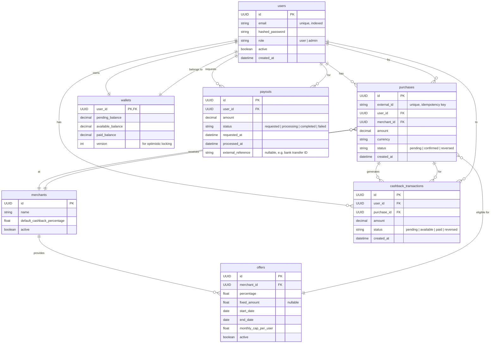

# Data Model

## 1. Overview

ClickNBack is a cashback platform that models financial incentive systems with strict correctness, idempotency, and concurrency requirements. The data model reflects core business entities (users, merchants, purchases, rewards) and enforces domain constraints at the database layer.

### 1.1 Why a Relational Database?

A relational database is the appropriate choice for this system because:

- **Financial Correctness**: Cashback involves monetary calculations, balance tracking, and state transitions that demand ACID transactions. A relational DB provides transactional guarantees that prevent lost updates, phantom reads, and inconsistent states.
- **Referential Integrity**: The domain has rich relationships (purchases must reference valid users/merchants, cashback requires a purchase, payouts reference users). Foreign key constraints enforce these invariants automatically.
- **Idempotency Enforcement**: Purchase ingestion uses external IDs as idempotency keys. Unique constraints at the database level prevent duplicate processing regardless of application retry logic.
- **Concurrency Control**: Wallet updates happen under concurrent access (multiple users requesting withdrawals, purchase confirmations arriving asynchronously). Row-level locking and optimistic concurrency control (version fields) are first-class features in SQL databases.
- **Query Flexibility**: Financial auditing requires tracing balances, reversals, and state changes. The ability to join across tables and aggregate data with standard SQL is invaluable for reporting and compliance.

---

## 2. Design Principles

- **Domain as Source of Truth**: The database schema directly reflects the domain model. Every table represents a meaningful business entity or value object.
- **Immutability Where Possible**: Records like purchases and cashback transactions are append-only. State changes create new records or update specific status fields rather than modifying core data.
- **Explicit State Machines**: Status fields (purchase status, cashback status) encode valid transitions. The schema itself documents allowed states.
- **Precision Over Performance**: Financial amounts use `decimal` type for exact arithmetic. No floating-point approximations.
- **Auditability**: Timestamp fields (`created_at`, `processed_at`) enable audit trails. Each record is traceable to its origin.
- **Minimal Redundancy**: Derived data (balances) is computed from primary records rather than duplicated. The wallet acts as a denormalized view for performance, but its correctness is maintained by transaction boundaries.

---

## 3. Key Design Decisions

### 3.1 Wallet as Denormalized State

The `wallet` table is a denormalized view of user balance, tracking pending, available, and paid balances separately. This design:

- Avoids expensive aggregations on `cashback_transactions` for every balance check
- Uses a `version` field for optimistic locking, preventing concurrent withdrawal conflicts
- Remains the single source of truth within a transaction

### 3.2 Purchase & Cashback Decoupling

`purchases` and `cashback_transactions` are separate entities:

- A purchase represents an external event (user bought something)
- A cashback transaction represents the platform's obligation to reward the user
- They have independent state machines (purchase can reverse while cashback is pending)
- This separation allows fine-grained control over different business rules

### 3.3 Offer Flexibility

The `offers` table supports both percentage-based and fixed-amount rewards. This captures real-world promotional variety without requiring schema changes.

### 3.4 Payout as Irreversible

Once a `payout` is created, the funds are considered withdrawn. Changes create corrective transactions (if needed) rather than modifying the original payout—preserving an immutable audit trail.

---

## 4. Consistency & Concurrency Strategy

### 4.1 Critical Sections

- **Purchase Ingestion**: Uses database transaction + unique constraint on `external_id` to ensure idempotency.
- **Wallet Withdrawal**: Uses either:
  - Row-level locking (SELECT FOR UPDATE)
  - Optimistic concurrency control (version field with CAS-style update)
  - Prevents double withdrawal and overdraft
- **Cashback State Transitions**: Transactions ensure balance adjustments are atomic with status changes.

### 4.2 Constraint Enforcement

- Foreign keys prevent orphaned records
- Unique constraints prevent duplicate purchases
- NOT NULL constraints on critical fields
- Implicit numeric constraints (amounts must be positive, handled in application layer)

### 4.3 Indexing Strategy

Indexes prioritize query patterns:

- User lookups for balance queries and transaction history
- Merchant active offers for purchase ingestion
- Status filters for batch operations (confirmation, reversal, payout processing)

---

## 5. Tables

### 5.1 users

| Field            | Type     | Constraints/Notes        |
|------------------|----------|--------------------------|
| id               | UUID     | PK                       |
| email            | string   | unique, indexed          |
| hashed_password  | string   |                          |
| role             | string   | user/admin               |
| active           | boolean  |                          |
| created_at       | datetime |                          |

---

### 5.2 merchants

| Field                       | Type    | Constraints/Notes |
|-----------------------------|---------|-------------------|
| id                          | UUID    | PK                |
| name                        | string  |                   |
| default_cashback_percentage | float   |                   |
| active                      | boolean |                   |

---

### 5.3 offers

| Field                | Type    | Constraints/Notes        |
|----------------------|---------|--------------------------|
| id                   | UUID    | PK                       |
| merchant_id          | UUID    | FK (merchants.id)        |
| percentage           | float   |                          |
| fixed_amount         | float   | nullable                 |
| start_date           | date    |                          |
| end_date             | date    |                          |
| monthly_cap_per_user | float   |                          |
| active               | boolean |                          |

**Indexes:**

| Index Name           | Columns                |
|----------------------|------------------------|
| merchant_id_idx      | merchant_id            |
| merchant_active_idx  | merchant_id, active    |

---

### 5.4 purchases

| Field         | Type     | Constraints/Notes                |
|---------------|----------|----------------------------------|
| id            | UUID     | PK                               |
| external_id   | string   | unique, idempotency key          |
| user_id       | UUID     | FK (users.id)                    |
| merchant_id   | UUID     | FK (merchants.id)                |
| amount        | decimal  |                                  |
| currency      | string   |                                  |
| status        | string   | pending/confirmed/reversed       |
| created_at    | datetime |                                  |

**Indexes:**

| Index Name         | Columns      |
|--------------------|--------------|
| external_id_unique | external_id  |

---

### 5.5 cashback_transactions

| Field        | Type     | Constraints/Notes                      |
|--------------|----------|----------------------------------------|
| id           | UUID     | PK                                     |
| user_id      | UUID     | FK (users.id)                          |
| purchase_id  | UUID     | FK (purchases.id)                      |
| amount       | decimal  |                                        |
| status       | string   | pending/available/paid/reversed        |
| created_at   | datetime |                                        |

**Indexes:**

| Index Name   | Columns        |
|--------------|----------------|
| user_id_idx  | user_id        |
| status_idx   | status         |

---

### 5.6 wallets

| Field            | Type     | Constraints/Notes        |
|------------------|----------|--------------------------|
| user_id          | UUID     | PK, FK (users.id)        |
| pending_balance  | decimal  |                          |
| available_balance| decimal  |                          |
| paid_balance     | decimal  |                          |
| version          | int      | for optimistic locking   |

---

### 5.7 payouts

| Field              | Type     | Constraints/Notes                          |
|--------------------|----------|--------------------------------------------|
| id                 | UUID     | PK                                         |
| user_id            | UUID     | FK (users.id)                              |
| amount             | decimal  |                                            |
| status             | string   | requested/processing/completed/failed      |
| requested_at       | datetime |                                            |
| processed_at       | datetime |                                            |
| external_reference | string   | nullable, e.g. bank transfer ID            |

**Indexes:**

| Index Name   | Columns   |
|--------------|-----------|
| user_id_idx  | user_id   |
| status_idx   | status    |

## 5.1 E-R Diagram

---

## 6. Scalability Considerations

### 6.1 Current Design (Monolithic)

The schema is designed for a single PostgreSQL instance handling millions of transactions. Performance optimizations focus on:

- Strategic indexing (merchant lookups, status filters, user-specific queries)
- Efficient wallet locking (minimizing row-lock contention)
- Denormalized wallet table (avoiding expensive aggregations)

### 6.2 Future Evolution Paths

If scale demands it, the model supports:

1. **Partitioning by User ID**: The structure naturally supports horizontal partitioning—each partition owns complete user data (purchases, cashback, wallet, payouts).

2. **Read Replicas**: The schema separates transactional operations (purchases, withdrawals) from reads (reports, history queries), enabling read-replica strategies.

3. **Event Streaming**: The immutable append-only nature (purchases, transactions, state changes) fits event-sourcing or CDC (Change Data Capture) patterns for downstream analytics.

4. **Archival Strategy**: Historical transactions can be archived by age, with summarization fields added as needed (e.g., `monthly_summary` table).

---

## 7. Trade-offs & Rationale

| Decision | Trade-off | Justification |
| ---------- | ----------- | --------------- |
| Wallet denormalization | Adds complexity to keep wallet in sync | Necessary for performance; withdrawal queries must be fast |
| Separate cashback_transactions table | Extra complexity vs. embedding in purchases | Enables independent state management and clear audit trails |
| Optimistic locking on wallet | Must handle retry logic in application | Reduces lock contention compared to pessimistic locking |
| Decimal for amounts | Slight storage/computation overhead | Mandatory for financial correctness |
| UUID for all primary keys | Larger keys, less cache-friendly | Enables distributed generation, easier resharding |

---

## 8. Design Validation Checklist

This data model supports the core requirements:

- ✅ Preventing duplicate purchases via `external_id` uniqueness
- ✅ Tracking wallet balances correctly under concurrent withdrawals
- ✅ Supporting purchase reversals without data corruption
- ✅ Enabling audit trails for compliance
- ✅ Enforcing referential integrity
- ✅ Querying purchase history, balance evolution, and payout records
- ✅ Isolating merchant and offer management from transaction processing
