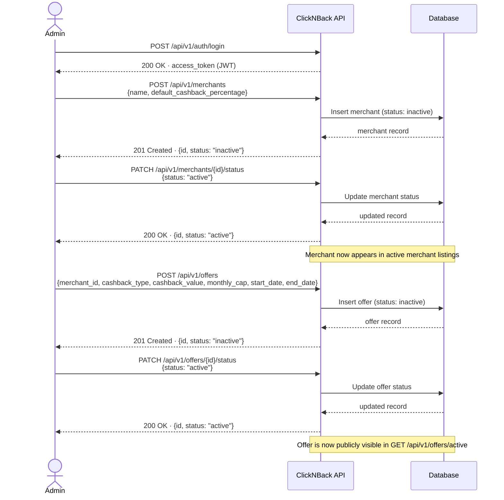

# Workflow 1 — Admin Platform Setup

> **Goal:** Get the platform ready for users to earn cashback — create a merchant, activate it, attach an offer, and activate the offer.
>
> **Who runs this:** Admin
>
> **Pre-condition:** Authenticated as admin.
>
> **HTTP file:** [`http/01-admin-platform-setup.http`](http/01-admin-platform-setup.http)

---

## Sequence Diagram

---

## Steps

| # | Action | Endpoint |
| --- | --- | --- |
| 1 | Login as admin | `POST /api/v1/auth/login` |
| 2 | Create a merchant with a default cashback percentage | `POST /api/v1/merchants` |
| 3 | Activate the merchant | `PATCH /api/v1/merchants/{merchant_id}/status` |
| 4 | Create an offer for the merchant (percent or fixed cashback, with date range and monthly cap) | `POST /api/v1/offers` |
| 5 | Activate the offer | `PATCH /api/v1/offers/{offer_id}/status` |

## What to Expect

- After step 3, the merchant appears when listing active merchants.
- After step 5, the offer appears in the public `GET /api/v1/offers/active` listing, visible to all authenticated users.
- A merchant can only have **one active offer at a time**. Creating a second offer for the same merchant while one is active will be rejected.
- Offers with a `start_date` in the past cannot be created. Use today's date or a future date.

---

_Back to [End-to-End Workflows](end-to-end-workflows.md)_
