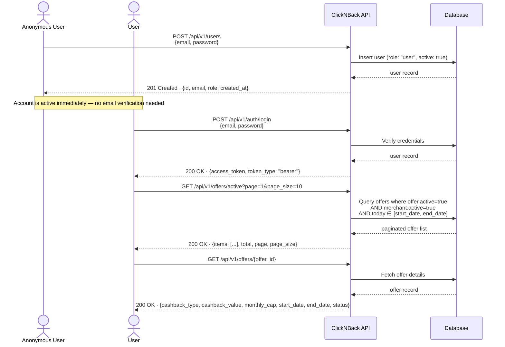

# Workflow 2 — User Registration and Offer Discovery

> **Goal:** Register as a new user, log in, and explore what cashback offers are currently available.
>
> **Who runs this:** An end-user (new to the platform).
>
> **Pre-condition:** At least one active merchant with an active offer exists (run Workflow 1 first, or use the pre-seeded demo data).
>
> **HTTP file:** [`http/02-user-discovery.http`](http/02-user-discovery.http)

---

## Sequence Diagram

---

## Steps

| # | Action | Endpoint |
| --- | --- | --- |
| 1 | Register a new user account | `POST /api/v1/users` |
| 2 | Login with the new credentials | `POST /api/v1/auth/login` |
| 3 | Browse the list of currently active offers | `GET /api/v1/offers/active` |
| 4 | View the details of a specific offer | `GET /api/v1/offers/{offer_id}` |

## What to Expect

- The user account is created immediately and is active by default.
- The `offers/active` endpoint applies three filters automatically: the offer must be `active`, its merchant must be `active`, and today's date must fall within `[start_date, end_date]`.
- The offer listing is paginated. Use `page` and `page_size` query parameters to navigate.
- Offer details show whether cashback is a fixed amount (`fixed`) or a percentage (`percent`), the `cashback_value`, and the `monthly_cap` — the maximum cashback a user can earn from that offer in a calendar month.

---

_Back to [End-to-End Workflows](end-to-end-workflows.md)_
