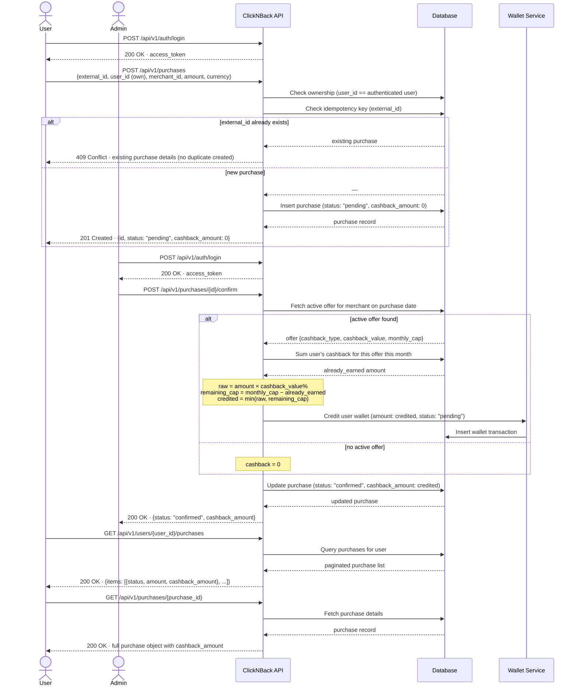

# Workflow 3 — Purchase Ingestion and Cashback Calculation

> **Goal:** Simulate a user recording their own purchase, confirm it, and verify that cashback is credited to the user's wallet.
>
> **Who runs this:** The user records their own purchase; confirmation is done by an admin.
>
> **Pre-condition:** An active merchant + active offer exist (Workflow 1). A registered user exists (Workflow 2). You are authenticated as the user whose purchase you are recording.
>
> **HTTP file:** [`http/03-purchase-and-cashback.http`](http/03-purchase-and-cashback.http)
>
> **Note:** Purchase, wallet, and payout endpoints are **backlog** features — they are designed and fully specified but not yet implemented. The `.http` file documents the intended interactions against the upcoming API surface.

---

## Sequence Diagram

---

## Steps

| # | Action | Endpoint |
| --- | --- | --- |
| 1 | (User) Login | `POST /api/v1/auth/login` |
| 2 | User records their own purchase | `POST /api/v1/purchases` |
| 3 | (Admin) Login | `POST /api/v1/auth/login` |
| 4 | Confirm the purchase (transitions it from `pending` → `confirmed`, triggers cashback calculation) | `POST /api/v1/purchases/{purchase_id}/confirm` |
| 5 | View the user's purchase history | `GET /api/v1/users/{user_id}/purchases` |
| 6 | View purchase details (includes calculated cashback amount) | `GET /api/v1/purchases/{purchase_id}` |

## What to Expect

- The purchase ingestion endpoint is **idempotent**: submitting the same `external_id` twice returns a 409 Conflict with details of the existing purchase — no duplicate is created. This ensures safe client-side retries.
- A freshly ingested purchase has `cashback_amount: 0` and `status: pending`.
- On confirmation, the system looks up the active offer for the merchant at the time of purchase, applies either the percentage or fixed-amount rule (capped by `monthly_cap_per_user`), and credits the user's wallet with a `pending` cashback transaction.
- If no active offer exists for the merchant at the time of purchase, cashback is `0`.

## Cashback Calculation Logic

Given an offer with `cashback_type = "percent"` and `cashback_value = 5.0` (5%) and a purchase of `€100.00`:

- Raw cashback = `€100.00 × 5% = €5.00`
- If the user has already earned `€3.00` from this offer this month and `monthly_cap = €6.00`, then only `€3.00` more can be credited (cap enforcement).
- The credited amount appears in the wallet as a `pending` balance.

---

_Back to [End-to-End Workflows](end-to-end-workflows.md)_
