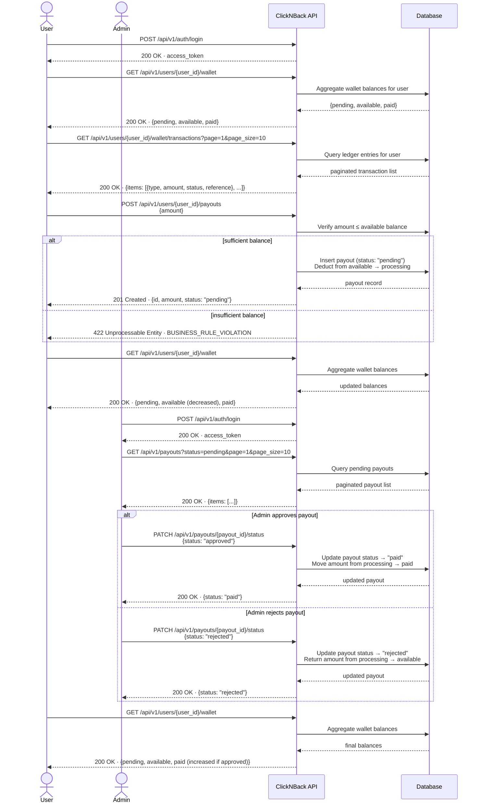

# Workflow 4 — Wallet and Payout

> **Goal:** Check a user's wallet balance and request a cashback withdrawal.
>
> **Who runs this:** User (to check and request), Admin (to process).
>
> **Pre-condition:** At least one confirmed purchase with cashback > 0 exists for the user (Workflow 3).
>
> **HTTP file:** [`http/04-wallet-and-payout.http`](http/04-wallet-and-payout.http)
>
> **Note:** These endpoints are **backlog** features — fully specified but not yet implemented.

---

## Sequence Diagram

---

## Steps

| # | Action | Endpoint |
| --- | --- | --- |
| 1 | (User) Login | `POST /api/v1/auth/login` |
| 2 | View wallet summary (pending, available, paid balances) | `GET /api/v1/users/{user_id}/wallet` |
| 3 | List wallet transactions | `GET /api/v1/users/{user_id}/wallet/transactions` |
| 4 | Request a payout (withdrawal) | `POST /api/v1/users/{user_id}/payouts` |
| 5 | (Admin) Login | `POST /api/v1/auth/login` |
| 6 | List all pending payouts | `GET /api/v1/payouts?status=pending` |
| 7 | Process (approve or reject) a payout | `PATCH /api/v1/payouts/{payout_id}/status` |
| 8 | (User) Verify wallet balances after processing | `GET /api/v1/users/{user_id}/wallet` |

## What to Expect

- The wallet has three balance buckets:
  - **pending** — cashback earned from purchases that are confirmed but not yet withdrawable (subject to a holding period in production).
  - **available** — cashback that the user can withdraw right now.
  - **paid** — total amount already withdrawn in past payouts.
- A payout request moves funds from `available` to a `processing` state.
- When the admin processes (approves) the payout, the `paid` balance increases and `processing` decreases.
- A rejected payout returns funds back to `available`.

---

_Back to [End-to-End Workflows](end-to-end-workflows.md)_
